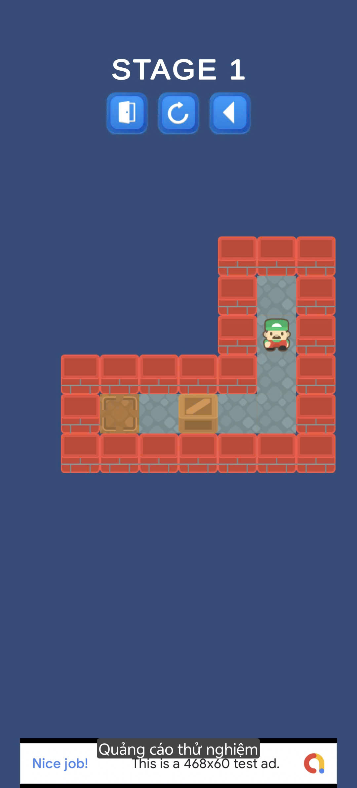

# Sokoban Game

A 2D puzzle game developed in Unity, inspired by the classic Sokoban gameplay where players push boxes to target positions to complete levels.

---

# Features
- Grid-based movement system
- Box pushing mechanics
- Level completion detection
- Multiple levels and scene management
- Background music and sound effects
- Restart level functionality
- Simple and clean pixel-art style

---

# Tech Stack
- Unity Engine
- C# scripting
- Object-Oriented Programming (OOP)
- Unity Tilemap System
- Unity Physics 2D
- Git & GitHub

---

# Gameplay
- Control the player character
- Push all boxes onto target tiles
- Solve puzzles with limited movement space
- Complete levels to progress

---

# Preview

---

# How to Run
1. Clone repository
2. Open project in Unity Hub
3. Open scene: `Menu`
4. Press Play

---

# Developer
- Name: Trung
- Role: Game Developer (Unity)
- GitHub: https://github.com/trunghhnd
- Itch: https://trunghhnd.itch.io/sokoban
- Youtube: https://www.youtube.com/watch?v=vTPfS0Gv7d4
